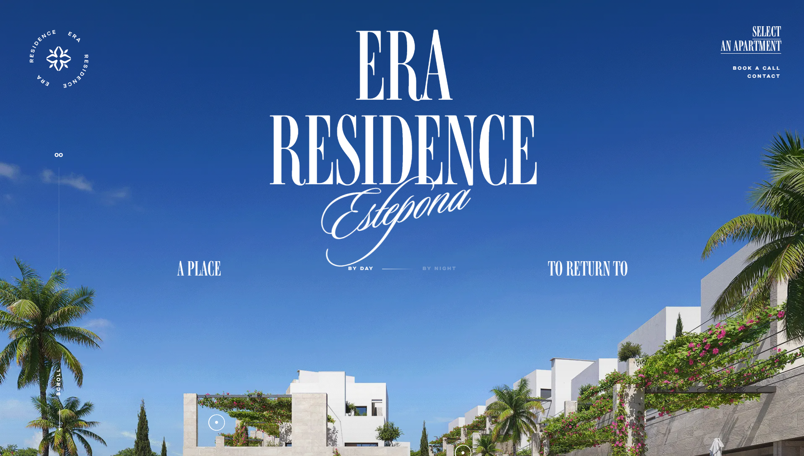

# ERA Residence Clone

A responsive recreation of the [ERA Residence](https://www.era-residence.com/) experience, built with Next.js, React, Tailwind CSS, GSAP, and Lottie. It includes a polished landing page, smooth scroll-driven interactions, animated sections, responsive layouts, and media-rich storytelling.

## Highlights

- Responsive design for desktop, tablet, and mobile screens
- Scroll animations and interactive motion effects
- Local fonts, optimized images, videos, and Lottie animations
- Interactive residence, amenities, location, and contact sections

## Showcase



## Run locally

```bash
npm install
npm run dev
```

Open [http://localhost:3000](http://localhost:3000) in your browser.
